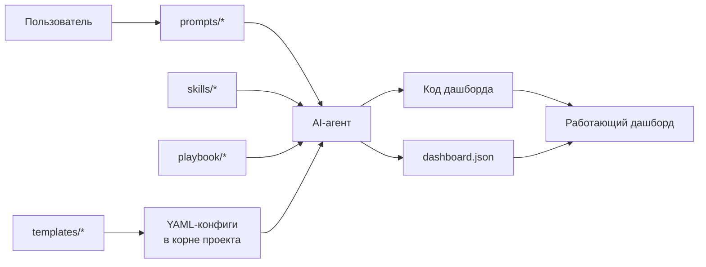

# Dashboard Prompt Kit

Универсальный набор инструкций, промтов и шаблонов, который позволяет
бизнес-пользователю за 30–60 минут получить собственный аналитический
дашборд любого домена — только через диалог с AI-агентом (Cursor / ChatGPT
/ Claude / Cline). Никакого написания кода руками.

Кит не зависит от:

- количества и типа источников данных (Excel/CSV/БД/API — любая комбинация);
- набора метрик (KPI, пороги, единицы — полностью ваши);
- стека реализации (Vanilla JS, React, Vue, Streamlit, Dash — ваш выбор);
- стиля и локализации (бренд, цвета, шрифты, язык UI — конфиг).

## Карта документов

### С чего начать

- [QUICKSTART.md](QUICKSTART.md) — сценарий «с нуля до дашборда за 30 минут».
Прочитайте первым.

### Playbook — пошаговые объяснения

1. [playbook/01-discovery.md](playbook/01-discovery.md) — сбор требований.
2. [playbook/02-data-contract.md](playbook/02-data-contract.md) — каноничная
  структура `dashboard.json`.
3. [playbook/03-source-mapping.md](playbook/03-source-mapping.md) — подключение
  любых источников.
4. [playbook/04-ui-spec.md](playbook/04-ui-spec.md) — настройка интерфейса.
5. [playbook/05-ai-assistant.md](playbook/05-ai-assistant.md) — чат и агент
  (опционально).
6. [playbook/06-forecast.md](playbook/06-forecast.md) — прогноз временных
  рядов (опционально).
7. [playbook/07-acceptance.md](playbook/07-acceptance.md) — приёмка дашборда.
8. [playbook/08-iteration.md](playbook/08-iteration.md) — жизнь после сборки:
  добавление метрик, бренда, источников.

### Prompts — готовые сообщения агенту

- [prompts/00-master.md](prompts/00-master.md) — первый промт, фиксирует роль.
- [prompts/10-discover.md](prompts/10-discover.md) — сбор требований.
- [prompts/20-map-data.md](prompts/20-map-data.md) — сборка `dashboard.json`.
- [prompts/30-build-ui.md](prompts/30-build-ui.md) — генерация интерфейса.
- [prompts/40-setup-agent.md](prompts/40-setup-agent.md) — AI-ассистент.
- [prompts/50-forecast.md](prompts/50-forecast.md) — прогноз.
- [prompts/90-acceptance.md](prompts/90-acceptance.md) — финальная приёмка.
- [prompts/99-fix.md](prompts/99-fix.md) — 7 шаблонов точечных правок.

### Skills — роли агента

- [skills/data-mapper/SKILL.md](skills/data-mapper/SKILL.md) — нормализация
источников в `dashboard.json`.
- [skills/dashboard-builder/SKILL.md](skills/dashboard-builder/SKILL.md) —
сборка UI на выбранном стеке.
- [skills/dashboard-assistant/SKILL.md](skills/dashboard-assistant/SKILL.md) —
правила ответов чата и агента.
- [skills/agent-tools/SKILL.md](skills/agent-tools/SKILL.md) — 7 стандартных
инструментов ReAct-агента.

### Templates — файлы, которые вы заполняете

- [templates/dashboard.schema.json](templates/dashboard.schema.json) —
JSON-схема каноничного `dashboard.json`.
- [templates/metric-catalog.example.yaml](templates/metric-catalog.example.yaml)
— каталог KPI и серий.
- [templates/source-manifest.example.yaml](templates/source-manifest.example.yaml)
— описание источников.
- [templates/brand.config.example.yaml](templates/brand.config.example.yaml)
— бренд и локаль.
- [templates/ui-layout.example.yaml](templates/ui-layout.example.yaml) —
раскладка интерфейса.
- [templates/acceptance-checklist.md](templates/acceptance-checklist.md) —
чек-лист приёмки.

### Examples — живые кейсы

- [examples/minimal/](examples/minimal/) — минимальный дашборд (1 CSV,
4 KPI, продажи).
- [examples/toir/](examples/toir/) — большой reference (7 Excel, 8 KPI,
10+ графиков, прогноз, агент).

### Справочники

- [glossary.md](glossary.md) — все термины кита.
- [faq.md](faq.md) — топ-20 вопросов.

## Как это работает

1. Вы отправляете промты из `kit/prompts/` агенту.
2. Агент читает свою роль из `kit/skills/`, инструкции из `kit/playbook/`
  и ваши конфиги (YAML в корне).
3. Агент пишет код дашборда и собирает `dashboard.json`.
4. Вы получаете работающий дашборд.
5. Любые правки — через конфиги, а не через код.

## Три уровня независимости

### От данных

- В `source-manifest.yaml` описываете любое число источников любого формата.
- Агент по `skills/data-mapper` нормализует их в единый `dashboard.json`,
соответствующий `templates/dashboard.schema.json`.

### От метрик

- В `metric-catalog.yaml` задаёте свои KPI: формулы, пороги, единицы, формат.
- Агент по `skills/dashboard-builder` строит KPI-карточки и графики по каталогу.
- Замена каталога → новый набор KPI без правки кода.

### От стека и языка

- Агент спрашивает ваш стек на шаге 30 и генерирует код под него.
- `brand.config.yaml -> i18n.locale` меняет язык интерфейса.
- `brand.config.yaml -> palette` — полный контроль над цветами.
- Все подписи тянутся из конфигов, никаких «зашитых» слов.

## Совместимость с AI-агентами

Кит протестирован в:

- **Cursor** (основной сценарий).
- **ChatGPT** — отправка промтов напрямую в чат.
- **Claude Desktop** + MCP.
- **Cline / Continue / VS Code agents**.

Любой агент, который умеет читать Markdown и выполнять tool-calling, справится.

## Лицензия и цитирование

Используйте и модифицируйте свободно. Reference-пример (`examples/toir/`)
основан на реальном проекте ТОиР-дашборда и доказывает, что кит работает
на сложных кейсах.